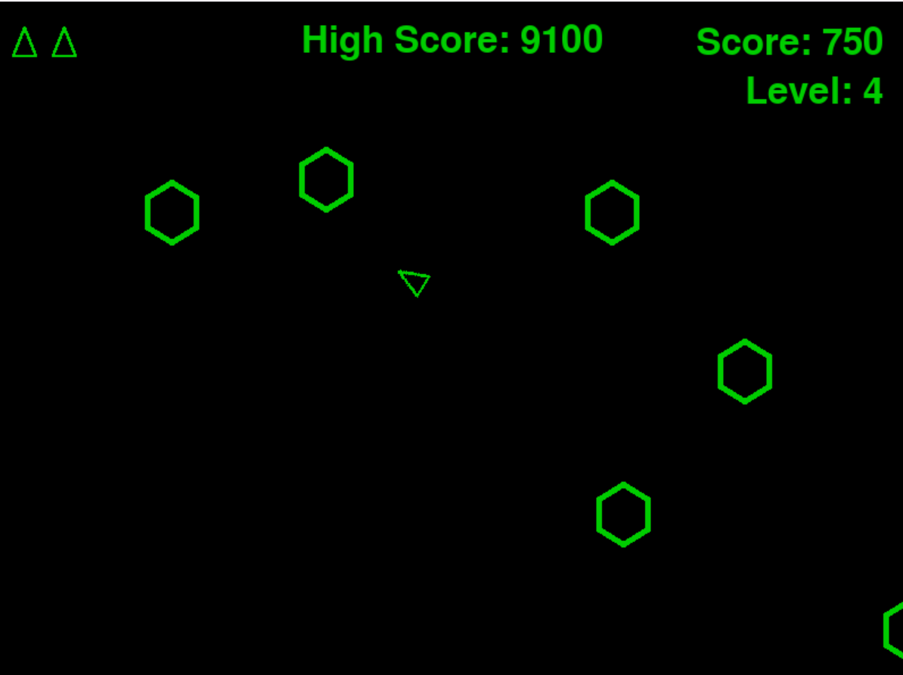

# asteroids_game
A python based remake of the classic game **Asteroids**, built with Pygame. Inspired by the "Alien Invasion" project in *Python Crash Course* by Eric Matthes, with additional features and mechanics.

---

## Features

- **Classic Gameplay**: Navigate your ship, destroy asteroids, and survive as long as possible.
- **Screen Wrapping**: Asteroids, ships, and bullets, wrap around the screen edges.
- **Level Implementation**: Levels get progressively harder with more asteroids.
- **Sound Effects**: Includes firing and explosion sounds.
- **Score Tracking**: Displays current score, level, and high score.

---

## Gameplay Screenshot



---

## Installation

1. Clone this repository
    ```bash
    git clone https://github.com/jsanford-dev/asteroids_game.git
    cd asteroids_game
    ```

2. Ensure you have Python 3.8 or higher installed. Install the required dependencies
    ```bash
    pip install pygame
    ```

3. Run the game
    ```bash
    python main.py
    ```

---

## How to play

 - Use the **arrow keys** to rotate (`←`/`→`) and thrust (`↑`) the spaceship.
 - Press the **Spacebar** to fire the bullets at asteroids.
 - Avoid collisions with asteroids to stay alive.
 - Clear all asteroids to progress to the next level.
 - Press **P** to pause and resume the game.

 ---
 ## Acknowledgments

 - Inspired by the "Alien Invasion" project from *Python Crash Course* by Eric Matthes.
 - Sound files were sourced from OpenGameArt.org
 - Asteroids and space ship images are placeholders; replace with your assets as needed. 

 ---

 ## Future Improvements

 - Add classic asteroid dynamics (e.g asteroids break into smaller asteroids once hit).
 - Add invincibility on respawn
 - Add power-ups (e.g. Hyperspeed)
 - Add high score persistence (e.g. saving scores to a file.)
 - Include animations for explosions and ship destruction.

 ---
 ### License

 This project is licensed under the MIT License. See 'LICENSE' for details.
